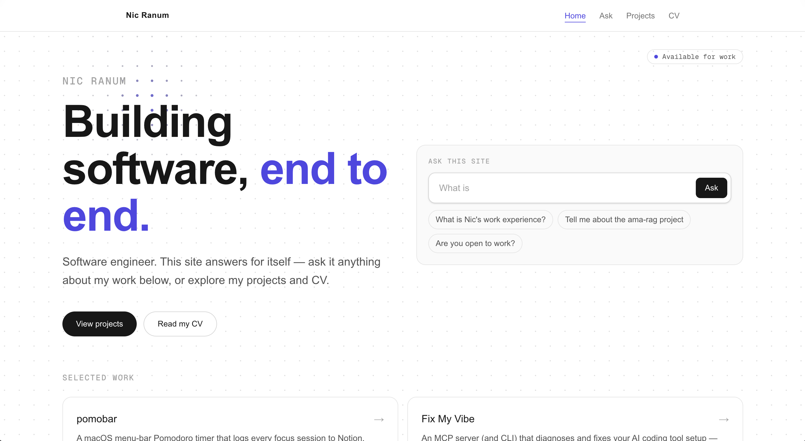

# nicjranum.uk

Personal portfolio and CV site for Nic Ranum. A statically-exported Next.js app with smooth
page transitions and a first-party RAG "ask this site" widget, deployed to Azure Static Web Apps
behind a Cloudflare-managed custom domain.

**Live:** [nicjranum.uk](https://nicjranum.uk)



## Highlights

- **Ask this site** — a retrieval-augmented "ask me anything" widget on the home page and at
  `/ask`, streaming answers over SSE from a separate RAG backend and citing its sources.
- **Data-driven projects** — every card and detail page is generated from a single list in
  `lib/projects.ts`; add a project by appending one object, no page edits required.
- **Smooth transitions** — Framer Motion wraps route changes; a subtle animated dot field sits
  behind every page.
- **Static export** — the whole site builds to plain HTML/JS (`output: 'export'`), served from
  Azure's global CDN.

## Tech Stack

| Concern      | Choice                                        |
| ------------ | --------------------------------------------- |
| Framework    | Next.js 16 (App Router), statically exported  |
| Language     | TypeScript                                    |
| Styling      | Tailwind CSS v4 (Ask widget uses CSS Modules) |
| Animation    | Framer Motion                                 |
| Hosting      | Azure Static Web Apps                         |
| CI/CD        | GitHub Actions (auto-generated by Azure)      |
| DNS / Domain | Cloudflare — nicjranum.uk                     |

## Getting Started

```bash
npm install
npm run dev      # dev server at http://localhost:3000
```

### Commands

```bash
npm run dev      # local dev server
npm run build    # production static export → ./out
npm run start    # serve a production build
npm run lint     # ESLint
```

## Configuration

The RAG widget talks to an external API. Its origin is a build-time public variable
(`NEXT_PUBLIC_` vars are inlined at build):

| Variable                   | Purpose                             |
| -------------------------- | ----------------------------------- |
| `NEXT_PUBLIC_API_BASE_URL` | Origin of the RAG "ask" backend API |

The committed `.env.production` sets this for the production build. For local dev against a local
API, override it in `.env.local` (git-ignored).

## Project Structure

```
app/
├── layout.tsx            # Root layout — nav, page-transition wrapper, dot field
├── page.tsx              # Home — hero, Ask widget, selected work
├── ask/page.tsx          # Full "ask this site" page
├── projects/
│   ├── page.tsx          # Projects index
│   └── [slug]/page.tsx   # Per-project detail page
├── cv/page.tsx           # CV
└── contact/page.tsx      # Contact
components/               # UI components (one per file, PascalCase)
lib/                      # Data + client logic (projects, cv, contact, RAG/SSE plumbing)
public/                   # Static assets (CV PDF, project media, icons)
```

## Conventions

- App Router patterns throughout (`app/`, `layout.tsx`, `page.tsx`); keep pages thin, push
  reusable UI into `components/`.
- TypeScript everywhere — no `any`.
- Tailwind for styling. **Exception:** the Ask widget (`components/AskWidget.tsx`,
  `SourceCards.tsx`, `lib/*`) uses CSS Modules and an owned `--rag-*` palette so it stays
  style-isolated from the host site. Its source of truth and tests live in the `ama-rag/web`
  repo — keep it as-is here.

## Deployment

Push to `main` → the Azure Static Web Apps GitHub Actions workflow runs `npm run build` and
deploys the `out/` export. The workflow file (`.github/workflows/azure-static-web-apps-*.yml`)
is generated and owned by Azure — don't rename or hand-edit it.

The custom domain is managed in Cloudflare. During Azure domain verification the Cloudflare proxy
(orange cloud) must be **off** on the CNAME; it can be toggled on afterwards, though Azure's
built-in CDN makes it optional.
